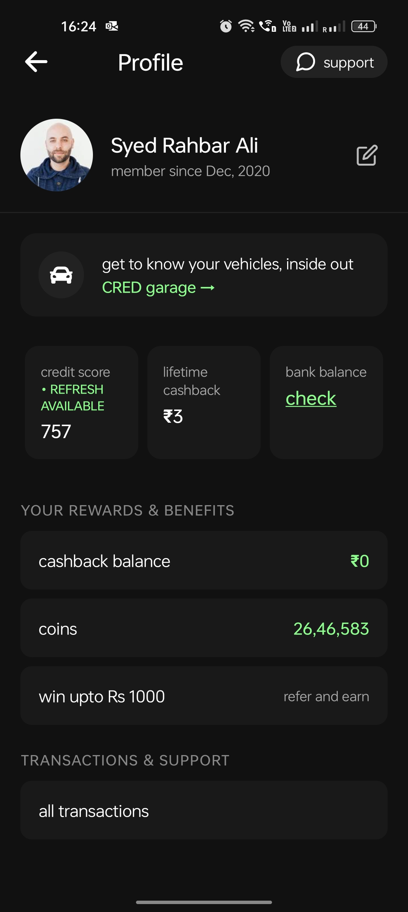

# CRED Profile UI (React Native + Expo)

A beautiful profile screen UI inspired by the CRED app, built with React Native and Expo.

## 📱 Screenshot



> **Note:** Replace `Assignment-android.jpg` with your actual screenshot file in the project root for best preview.

---

## 🚀 Getting Started

Follow these steps to initialize and run the project on your local machine:

### 1. Clone the Repository

```bash
git clone <your-repo-url>
cd cred-profile-ui
```

### 2. Install Dependencies

```bash
npm install
```

### 3. Start the Expo Development Server

```bash
npx expo start
```

### 4. Run on Your Device

- Install the **Expo Go** app from the [Google Play Store](https://play.google.com/store/apps/details?id=host.exp.exponent) or [Apple App Store](https://apps.apple.com/app/expo-go/id982107779).
- Scan the QR code shown in your terminal or browser with the Expo Go app.
- The app will open and you'll see the CRED-style profile UI.

---

## 📝 Customization

- To change the profile name or image, edit the `App.js` file.
- For any UI changes, update the styles and components in `App.js`.

---

## 📸 Adding a Screenshot

1. Run the app on your device or emulator.
2. Take a screenshot of the profile screen.
3. Save the screenshot as `screenshot.png` in the project root directory.

---

## 🤝 Contributing

Pull requests are welcome! For major changes, please open an issue first to discuss what you would like to change.

---

## 📄 License

This project is for educational/demo purposes only and is not affiliated with CRED.
